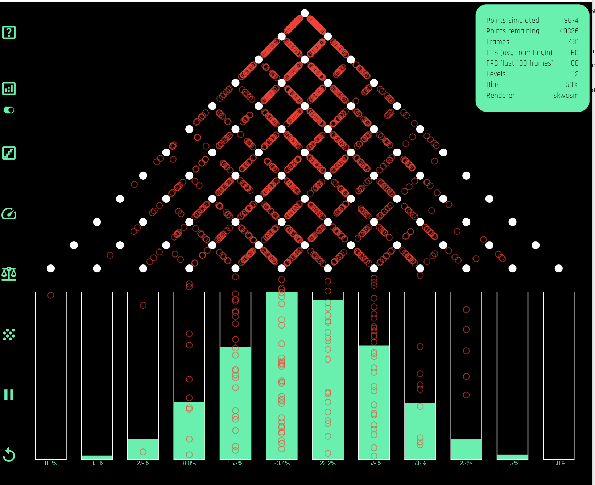

# What is this?
Simulates a Galtonboard. hosted at [https://galtonboard.pages.dev/](https://galtonboard.pages.dev/). A Galton board simulates a Gaussian distribution by taking a point and randomly sending it left or right over many obstacles. 

This simulation supports many parameters
- Slowing up or speeding down the simulation
- Drawing thousands of circles per frame to 1 circle per frame
- Number of levels to simulate
- Pausing and Resuming
- Bias of each point (e.g. goes left with 90% probability)
- Rendering stats (e.g. FPS)
- Animating filled buckets (see bottom of picture)

All the above has to be done at 60 FPS without any stutter or visually noticeable gaps.

# Why this?

This was my first project in Flutter. I was always fascinated by Flutters `UI = f(State)` headline and wanted to give it a try. 

I chose this relatively complex project to learn if Flutter could ergonomically support huge frontend codebases. This example would easily expose any Flutter shortcomings because it has a ton of user controls, manages a ton of state, needs to stay performant and run as a mobile app (Android in my case) and web from the same codebase.

# How did Flutter do?
 Turns out Flutter has a lot of good stuff. For example,
- The layout engine is O(N) (unlike CSS and other layouts)
- Views are expressed as simple compositions of other views and primitives
- Allows a gaming like experience on the Web. There's support for shaders. In this project, I only use `drawAtlas` which batches a bunch of points and sends to GPU for rendering
- Compiles to wasm
- Devx is fantastic for a frontend. Very quick refresh cycle
- This same code compiles into an Android app and renders well natively too (terrific!)

Overall, the framework is quite impressive.

# Flutter's shortcomings

I did run into problems with (1) State management (2) WASM support on the web.

State management is intrinsically hard in UIs and Flutter doesn't have a great story. I looked at React and that looked way worse. The libraries in the ecosystem are not suitable for large scale Flutter development. I think I looked at Riverpod, Provider, Bloc and GetX and all of them have significant shortcomings.

WASM support was still immature as of late 2024. There were significant memory issues as the webapp would continuously increase memory usage until OOMing Chrome.

# My State Management Solution

See my [state management mental model](state_management.md). It took me a while to solve but I built a state management solution. It is to my taste and I find it ergonomic even for large codebases. It pretty much follows from `UI = f(State)`. 

# How does it look ?
